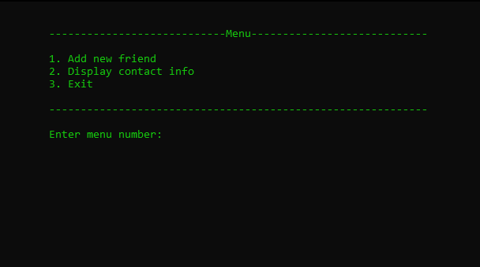
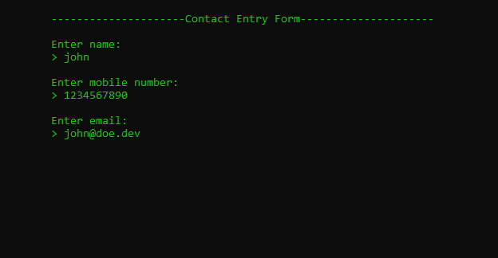
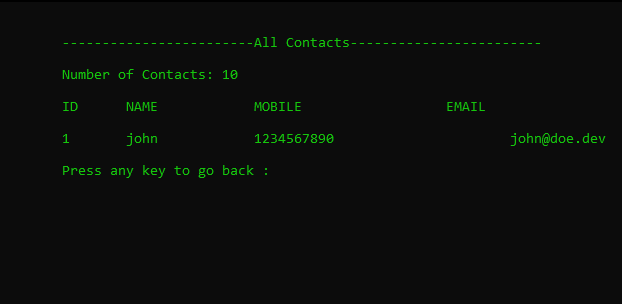
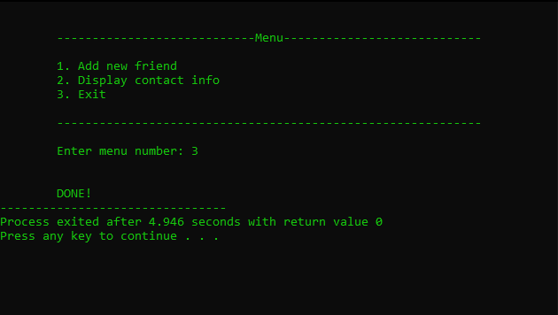

<h1>Basic Contacts App</h1>

# 

A basic application to manage contacts in C programming language. 

> NB: It is intended to work on Windows OS since it uses a system call interface to clear screen and also change text color.

## Features

- Add new contacts
- Display all contacts
- Reusable menu system
- Dynamic header

> NB: The data entered is not permanently stored as this was a basic implementation of a contacts app. **File handling** or **Database** knowledge is required to have persist data.

## Samples

- **Menu**

Provides numbered options, enter one of the available options, 1 or 2 or 3

- **New Contact Form**

Prompts the user to enter details of one contact, one by one.

> Don't include spaces as it would cause a few errors

- **All Contacts**

Display details of each contact in the contacts list

- **Exit**

Exits can be either voluntary or involuntary. In case of a voluntary exit, it's either successful execution start to end or a minor error occured. In case of an involuntary eixt, it's either the complier crashed or a fatal error occured.

## Thoughts

In case of any issues, open an issue on this repo or if you're contributing, a pull request is welcome.

_Thank You_
